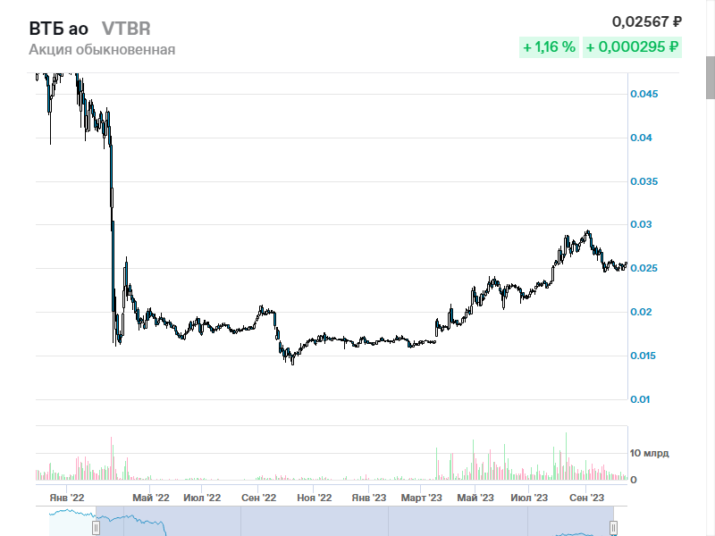
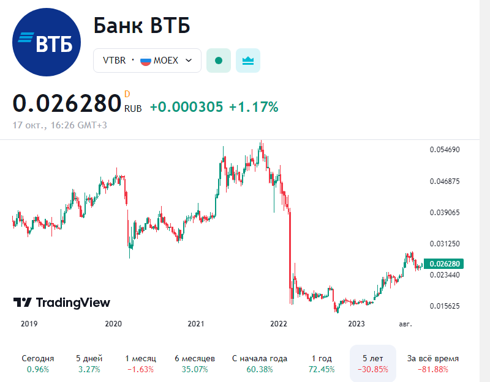
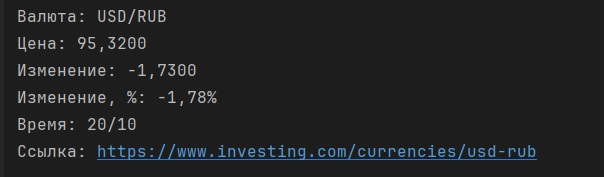

# Автоматизированный сбор данных о финансовых инструментах с Московской биржи и с сервиса для торговли на бирже TradingView

Этот проект представляет собой пробный вариант автоматизированного скрипта для поиска финансовых инструментов на сайте 
Московской биржи, TradingView, Investing. Извлечения их параметров, создания скриншота страницы с этой информацией. 

Этот функционал может быть использован для создания телеграм-бота, 
который позволит пользователям искать финансовые инструменты и получать информацию о них.

Программа выполнит поиск финансового инструмента на сайтах Московской биржи, TradingView, Investing.
Откроет страницу с его параметрами, сделает скриншот этой страницы и сохранит его в файл.
При использовании функционала в телеграм-боте, данный файл (скриншот) будет предоставлен пользователю или будут 
представлены данные о финансовом инструменте

**Пример скриншота Московской биржи:**

**Пример скриншота TradingView:**

**Пример скриншота Investing (получение данных запрашиваемой валютной пары):**

### Примечания

- Это пробная версия проекта, в которой не использовались классы, функции. Проект можно будет расширить и оптимизировать.

- Убедитесь, что у вас установлен браузер Google Chrome и драйвер Chrome WebDriver Manager.

- Настройте файл config.yaml с нужными локаторами элементов на сайте Московской биржи и желаемой задержкой между действиями.

